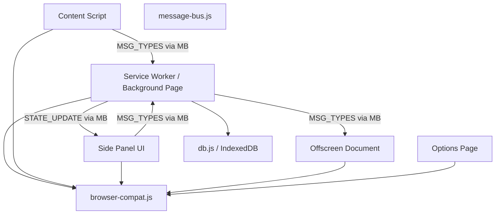
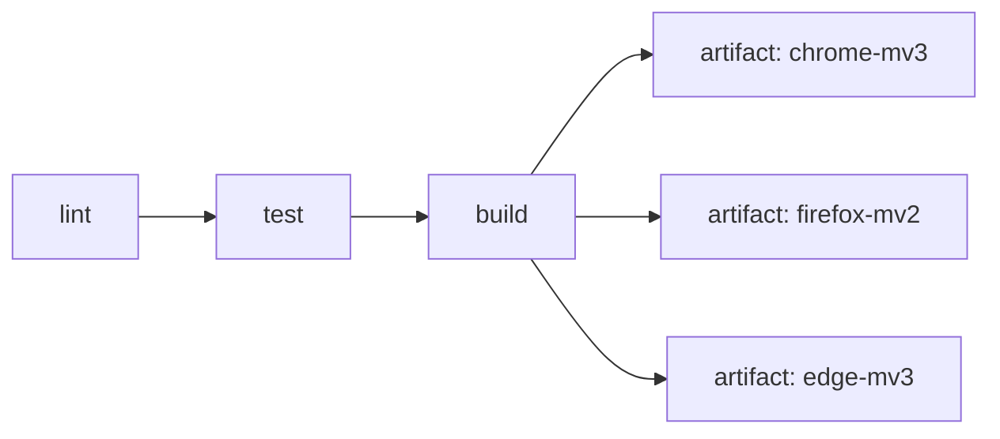

# Design Document: Project Scaffolding (Phase 0)

## Overview

Phase 0 establishes the complete structural and tooling foundation for the Voxara browser extension. The output is a buildable, loadable skeleton — no functional features, but every architectural decision locked in: multi-target manifests, Vite + CRXJS build system, canonical source layout, browser compatibility abstraction, typed message-passing, IndexedDB schema bootstrap, and GitHub Actions CI/CD.

The design follows the constraints established in the PRD and steering documents:
- Chrome/Edge use Manifest V3 with a Service Worker background context
- Firefox uses Manifest V2 with a persistent background page
- All browser API differences are hidden behind `browser-compat.js`
- The Service Worker is the single source of truth for application state
- IndexedDB (via `idb`) is the only persistent storage for document data

---

## Architecture

The extension is composed of five distinct runtime contexts. Phase 0 creates the entry-point stubs and wiring for all five, plus the shared infrastructure they depend on.



### Build Target Matrix

| Target | Manifest | Background Context | Offscreen |
|---|---|---|---|
| `chrome-mv3` | MV3 | Service Worker | Offscreen Document API |
| `edge-mv3` | MV3 | Service Worker | Offscreen Document API |
| `firefox-mv2` | MV2 | Background Page | Hidden `<iframe>` |

Each target has its own `vite.config.{target}.js` and `manifest.{target}.json`. The CRXJS plugin reads the manifest and wires entry points automatically.

---

## Components and Interfaces

### 1. Build System (`vite.config.*.js`)

Three Vite config files, one per target. Each imports the CRXJS plugin and points at the target-specific manifest.

```js
// vite.config.chrome.js (representative)
import { defineConfig } from 'vite'
import { crx } from '@crxjs/vite-plugin'
import manifest from './manifests/manifest.chrome.json'

export default defineConfig({
  plugins: [crx({ manifest })],
  build: { outDir: 'dist/chrome-mv3', sourcemap: true }
})
```

npm scripts in `package.json`:

| Script | Action |
|---|---|
| `dev:chrome` | `vite --config vite.config.chrome.js` |
| `dev:firefox` | `vite --config vite.config.firefox.js` |
| `build:chrome` | `vite build --config vite.config.chrome.js` |
| `build:firefox` | `vite build --config vite.config.firefox.js` |
| `build:edge` | `vite build --config vite.config.edge.js` |
| `build` | runs all three build scripts sequentially |
| `lint` | `eslint src/` |
| `test` | `vitest --run` |

### 2. Manifest Files (`manifests/`)

Three JSON files. Chrome and Edge manifests are nearly identical (differ only in `name`). Firefox uses MV2 with `background.scripts` instead of `background.service_worker`.

**Chrome MV3 key fields:**
```json
{
  "manifest_version": 3,
  "permissions": ["storage", "activeTab", "scripting", "sidePanel", "offscreen", "alarms"],
  "host_permissions": ["<all_urls>"],
  "background": { "service_worker": "src/background/index.js", "type": "module" },
  "content_scripts": [{ "matches": ["<all_urls>"], "js": ["src/content/index.js"], "run_at": "document_start" }],
  "side_panel": { "default_path": "src/sidepanel/index.html" },
  "options_ui": { "page": "src/options/index.html" }
}
```

**Firefox MV2 key differences:**
```json
{
  "manifest_version": 2,
  "background": { "scripts": ["src/background/index.js"], "persistent": false },
  "browser_action": {},
  "permissions": ["storage", "activeTab", "scripting", "alarms", "<all_urls>"]
}
```

> Firefox MV2 does not support `sidePanel` or `offscreen` — these are omitted. The compatibility layer handles the fallbacks at runtime.

### 3. Source Entry Points (`src/`)

Each entry point is a stub that imports shared infrastructure and registers itself. No functional logic in Phase 0.

```
src/
  background/index.js     — imports BrowserCompat, MessageBus, initDB; registers onMessage
  content/index.js        — imports BrowserCompat, MessageBus; logs context ready
  sidepanel/index.html    — shell HTML
  sidepanel/index.js      — imports BrowserCompat, MessageBus; logs context ready
  offscreen/index.html    — shell HTML
  offscreen/index.js      — imports BrowserCompat, MessageBus; logs context ready
  options/index.html      — shell HTML
  options/index.js        — imports BrowserCompat; logs context ready
  shared/
    browser-compat.js     — BrowserCompat class
    message-bus.js        — MessageBus helpers + MSG_TYPES enum
    db.js                 — initDB() function
```

### 4. Browser Compatibility Layer (`src/shared/browser-compat.js`)

Exports a single class with a static `init()` factory. Detects the runtime environment by checking `typeof chrome !== 'undefined'` vs `typeof browser !== 'undefined'`, then returns a unified API object.

```js
export class BrowserCompat {
  static async init() { ... }

  // Returned unified API shape:
  // {
  //   storage: { get(key), set(key, value), remove(key) }
  //   runtime: { sendMessage(msg), onMessage(handler) }
  //   sidePanel: { open(), close() }
  //   tabs: { query(opts), update(tabId, props) }
  // }
}
```

Detection logic:
- `chrome` global present → Chrome/Edge path (uses `chrome.*`)
- `browser` global present → Firefox path (uses `browser.*` which returns Promises natively)
- Neither → throws `BrowserCompatError('Unsupported browser environment')`

`sidePanel` namespace:
- Chrome/Edge: delegates to `chrome.sidePanel.*`
- Firefox: delegates to `browser.sidebarAction.*`
- Fallback: no-op with console warning

### 5. Message Bus (`src/shared/message-bus.js`)

Exports `MSG_TYPES` enum and two helpers.

```js
export const MSG_TYPES = Object.freeze({
  // Playback
  PLAY_CHUNK: 'PLAY_CHUNK',
  PAUSE_PLAYBACK: 'PAUSE_PLAYBACK',
  RESUME_PLAYBACK: 'RESUME_PLAYBACK',
  CHUNK_STARTED: 'CHUNK_STARTED',
  CHUNK_ENDED: 'CHUNK_ENDED',
  // AI
  AI_QUERY: 'AI_QUERY',
  AI_RESPONSE: 'AI_RESPONSE',
  // State
  STATE_UPDATE: 'STATE_UPDATE',
  ACTION: 'ACTION',
  // Voice
  VOICE_CHANGE: 'VOICE_CHANGE',
})

// sendMessage: generates requestId, constructs envelope, dispatches via BrowserCompat
export async function sendMessage(type, payload, compat) { ... }

// onMessage: registers listener, validates envelope schema, discards malformed messages
export function onMessage(handler, compat) { ... }
```

Envelope schema validation: checks that `type` is a string, `payload` is an object, and `requestId` is a non-empty string. Malformed messages are logged as warnings and dropped.

### 6. IndexedDB Schema (`src/shared/db.js`)

```js
import { openDB } from 'idb'

const DB_NAME = 'voxara'
const DB_VERSION = 1

export async function initDB() {
  return openDB(DB_NAME, DB_VERSION, {
    upgrade(db) {
      // documents store
      const docs = db.createObjectStore('documents', { keyPath: 'id' })
      docs.createIndex('url', 'url', { unique: false })

      // chunks store
      const chunks = db.createObjectStore('chunks', { keyPath: 'id' })
      chunks.createIndex('documentId', 'documentId')
      chunks.createIndex('sequenceIndex', 'sequenceIndex')
      chunks.createIndex('text', 'text')

      // playbackStates store
      db.createObjectStore('playbackStates', { keyPath: 'documentId' })

      // chatThreads store
      db.createObjectStore('chatThreads', { keyPath: 'id' })
    }
  })
}
```

`initDB()` is called once in the Service Worker / Background Page on startup. The `idb` library handles the `onupgradeneeded` lifecycle — if the DB already exists at version 1, `upgrade` is not called.

### 7. CI/CD Pipeline (`.github/workflows/ci.yml`)

Three sequential jobs: `lint` → `test` → `build`. The build job runs all three targets and uploads each `dist/` subdirectory as a named artifact. `node_modules` is cached on `package-lock.json` hash.



---

## Data Models

### Message Envelope

```ts
interface MessageEnvelope {
  type: string        // one of MSG_TYPES values
  payload: object     // message-specific data
  requestId: string   // UUID v4, generated by sendMessage()
}
```

### IndexedDB Object Stores

Defined in full in PRD §6.2. Phase 0 creates the stores and indexes; no data is written by the skeleton itself.

| Store | Primary Key | Indexes |
|---|---|---|
| `documents` | `id` (UUID) | `url` |
| `chunks` | `id` (UUID) | `documentId`, `sequenceIndex`, `text` |
| `playbackStates` | `documentId` | — |
| `chatThreads` | `id` | — |

### BrowserCompat Unified API Shape

```ts
interface CompatAPI {
  storage: {
    get(key: string): Promise<any>
    set(key: string, value: any): Promise<void>
    remove(key: string): Promise<void>
  }
  runtime: {
    sendMessage(msg: MessageEnvelope): Promise<any>
    onMessage(handler: (msg: MessageEnvelope) => void): void
  }
  sidePanel: {
    open(): Promise<void>
    close(): Promise<void>
  }
  tabs: {
    query(opts: object): Promise<Tab[]>
    update(tabId: number, props: object): Promise<Tab>
  }
}
```

---

## Correctness Properties

*A property is a characteristic or behavior that should hold true across all valid executions of a system — essentially, a formal statement about what the system should do. Properties serve as the bridge between human-readable specifications and machine-verifiable correctness guarantees.*

### Property 1: Build produces all three dist directories

*For any* clean workspace, running `npm run build` should produce non-empty output directories at `dist/chrome-mv3/`, `dist/firefox-mv2/`, and `dist/edge-mv3/`, each containing a `manifest.json`.

**Validates: Requirements 1.6, 2.4, 3.3, 4.3**

### Property 2: Chrome and Edge manifests are structurally equivalent

*For any* build output, the `manifest.json` in `dist/chrome-mv3/` and `dist/edge-mv3/` should declare identical permissions, host_permissions, and entry point paths — differing only in the `name` field.

**Validates: Requirements 3.2**

### Property 3: BrowserCompat init returns a complete API object

*For any* supported browser environment, calling `BrowserCompat.init()` should return an object that has all four namespaces (`storage`, `runtime`, `sidePanel`, `tabs`), each with the expected callable methods.

**Validates: Requirements 6.2, 6.3, 6.4, 6.5, 6.6**

### Property 4: BrowserCompat throws on unsupported environments

*For any* environment where neither `chrome` nor `browser` globals are present, `BrowserCompat.init()` should throw an error with a descriptive message identifying the missing capability.

**Validates: Requirements 6.7**

### Property 5: sendMessage produces valid envelopes

*For any* message type from `MSG_TYPES` and any payload object, `sendMessage(type, payload)` should produce an envelope where `type` matches the input, `payload` matches the input, and `requestId` is a non-empty UUID v4 string.

**Validates: Requirements 7.1, 7.3**

### Property 6: onMessage discards malformed envelopes

*For any* message object that is missing `type`, `payload`, or `requestId`, the `onMessage` handler should not be invoked, and a warning should be logged.

**Validates: Requirements 7.5**

### Property 7: initDB creates all four object stores

*For any* fresh browser profile (no existing database), calling `initDB()` should resolve to a database instance that contains exactly the object stores: `documents`, `chunks`, `playbackStates`, and `chatThreads`.

**Validates: Requirements 8.1, 8.2, 8.3, 8.4, 8.5, 8.7**

### Property 8: initDB is idempotent on existing databases

*For any* browser profile where the database already exists at version 1, calling `initDB()` again should resolve successfully without modifying the existing object stores or their contents.

**Validates: Requirements 8.8**

### Property 9: MSG_TYPES enum is exhaustive and frozen

*For any* message type string used anywhere in the codebase, it should be present as a value in `MSG_TYPES`. The `MSG_TYPES` object should be frozen (no new keys can be added at runtime).

**Validates: Requirements 7.2**

---

## Error Handling

### Build Errors
- Vite exits with a non-zero code on any build failure — CI picks this up automatically
- CRXJS validates the manifest at build time; invalid manifests fail the build with a descriptive error

### BrowserCompat Errors
- Unsupported environment: throws `BrowserCompatError` with message `'Unsupported browser environment: neither chrome nor browser global found'`
- Missing API (e.g. `sidePanel` on Firefox): logs a console warning and returns a no-op stub rather than throwing, to avoid crashing unrelated code paths

### MessageBus Errors
- Malformed envelope: `console.warn('[MessageBus] Discarded malformed message:', msg)` — handler not called
- Send failure (e.g. no listener): the underlying `runtime.sendMessage` rejection is propagated to the caller

### IndexedDB Errors
- Upgrade transaction failure: `initDB()` rejects with `'IndexedDB upgrade failed: ' + error.message`
- Version conflict (downgrade attempt): `idb` throws automatically; `initDB()` propagates the rejection

### CI Pipeline Errors
- Any job failure sets the workflow status to failed
- Branch protection rules (configured separately in GitHub) can block merges on failure

---

## Testing Strategy

### Dual Testing Approach

Both unit tests and property-based tests are required. They are complementary:
- Unit tests cover specific examples, integration points, and error conditions
- Property tests verify universal correctness across randomised inputs

### Unit Tests

Focus areas for Phase 0:
- `BrowserCompat.init()` returns correct shape for mocked Chrome and Firefox environments
- `BrowserCompat.init()` throws when neither global is present
- `sendMessage()` constructs a valid envelope with a UUID requestId
- `onMessage()` does not invoke handler for malformed messages
- `initDB()` creates all four stores on a fresh DB (using fake-indexeddb)
- `initDB()` opens without error when DB already exists

### Property-Based Tests

Library: **fast-check** (JavaScript, works with Vitest)

Each property test runs a minimum of 100 iterations.

**Property 3: BrowserCompat init returns a complete API object**
```
// Feature: project-scaffolding, Property 3: BrowserCompat init returns complete API
fc.assert(fc.property(fc.constantFrom('chrome', 'firefox'), (env) => {
  const compat = BrowserCompat.initWithEnv(mockEnv(env))
  return ['storage', 'runtime', 'sidePanel', 'tabs'].every(ns => ns in compat)
}), { numRuns: 100 })
```

**Property 5: sendMessage produces valid envelopes**
```
// Feature: project-scaffolding, Property 5: sendMessage produces valid envelopes
fc.assert(fc.property(
  fc.constantFrom(...Object.values(MSG_TYPES)),
  fc.object(),
  (type, payload) => {
    const envelope = buildEnvelope(type, payload)
    return envelope.type === type
      && envelope.payload === payload
      && isUUIDv4(envelope.requestId)
  }
), { numRuns: 100 })
```

**Property 6: onMessage discards malformed envelopes**
```
// Feature: project-scaffolding, Property 6: onMessage discards malformed envelopes
fc.assert(fc.property(
  fc.record({ type: fc.option(fc.string()), payload: fc.option(fc.object()), requestId: fc.option(fc.string()) },
    { withDeletedKeys: true }),
  (msg) => {
    const isValid = typeof msg.type === 'string' && typeof msg.payload === 'object' && typeof msg.requestId === 'string' && msg.requestId.length > 0
    const handlerCalled = simulateOnMessage(msg)
    return isValid ? handlerCalled : !handlerCalled
  }
), { numRuns: 100 })
```

**Property 7: initDB creates all four object stores**
```
// Feature: project-scaffolding, Property 7: initDB creates all four object stores
// Uses fake-indexeddb to simulate fresh profiles
fc.assert(fc.asyncProperty(fc.constant(null), async () => {
  const db = await initDB()
  const stores = Array.from(db.objectStoreNames)
  return ['documents', 'chunks', 'playbackStates', 'chatThreads'].every(s => stores.includes(s))
}), { numRuns: 100 })
```

**Property 8: initDB is idempotent**
```
// Feature: project-scaffolding, Property 8: initDB is idempotent on existing databases
fc.assert(fc.asyncProperty(fc.constant(null), async () => {
  await initDB()
  const db2 = await initDB()
  const stores = Array.from(db2.objectStoreNames)
  return ['documents', 'chunks', 'playbackStates', 'chatThreads'].every(s => stores.includes(s))
}), { numRuns: 100 })
```

**Property 9: MSG_TYPES is frozen and exhaustive**
```
// Feature: project-scaffolding, Property 9: MSG_TYPES enum is frozen
fc.assert(fc.property(fc.string(), (key) => {
  try { MSG_TYPES[key] = 'injected'; } catch (e) { /* expected */ }
  return !('injected' in MSG_TYPES) || Object.values(MSG_TYPES).includes('injected') === false
}), { numRuns: 100 })
```

### Test Configuration

```js
// vitest.config.js
export default {
  test: {
    environment: 'node',
    setupFiles: ['./test/setup.js'], // installs fake-indexeddb
  }
}
```

`fake-indexeddb` is used to simulate IndexedDB in the Node test environment without a real browser.
